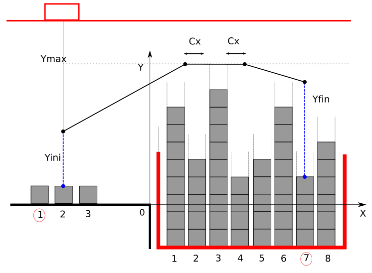

# PFAutomatas

Dock crane control. "Model in the loop" simulation using Simulink and "Software" in the loop simulation using Codesys (IEC 61131-3).

In this project we developed a hibrid semi-automatic control of a dock crane to move containers from and a dock to a ship and viceversa. 

The developement was done using simulink and then the code was migrated to codesys.
Open *matlab/Proyecto_Final.slx* using Simulink 2018 or higher. A statte machine was developed using StateFlow. To open the Codesys project run the *codesys/trajectories.project*.

All the infomation about the used design and the project explanation can be found in Spanish under *informe/Proyecto_Automatas.pdf*
